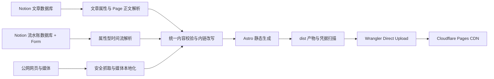

<p align="center">
  
</p>

# PageComet

一个可以直接 Fork 或克隆使用的开源个人网站模板：以 Notion 文章数据库和独立流水账数据库为内容源，由 Astro 在构建阶段生成完整静态页面，再通过 Cloudflare Pages Direct Upload 发布。

`PageComet` 由 Page 与 Comet 组成：把日常维护留在 Notion，把最终网站变成快速、独立且不暴露凭据的静态产物。

线上示例：[wenren.cc](https://wenren.cc)

这个仓库同时是 Wenren 当前网站的生产代码和可复用模板。仓库只提交虚构的 Alice 配置与固定测试内容；个人域名、联系方式、Notion 页面映射、Token 和 Data Source ID 都不会进入 Git。

## 零密钥快速预览

Node.js 需要 22.13 或更高版本，仓库已经提供 `.nvmrc`。

```bash
git clone https://github.com/shaun17/PageComet.git pagecomet
cd pagecomet
nvm use
npm ci
npm run dev:fixture
```

打开终端显示的本地地址即可。`dev:fixture` 使用仓库内的文章、流水账和媒体夹具，不读取 `.env`，不访问 Notion，也不需要 Cloudflare 账号。

接入自己的内容只需要完成四件事：

1. 复制并填写本机站点配置；
2. 在 Notion 创建文章数据库和独立流水账数据库；
3. 为流水账数据库添加一个私有 Form 视图；
4. 填写 `.env`，构建并部署。

这里的“即开即用”分为两层：工程和 fixture 可以零配置启动；真实生产内容采用引导式配置，需要在自己的 Notion 工作区手动建立两套 schema 与 Form。仓库目前不附带可复制的 Notion 模板，不会自动改动使用者的工作区。

## 项目能力

- 四栏首页：职业经历、个人作品、文稿、流水账；
- 文章内容生成分类目录和 `/<category>/<slug>/` 静态详情页；
- 首页的流水账栏只保留 `/journal/` 入口，不展示条目目录；
- 流水账集中平铺展示，不生成单条详情页或永久链接；
- 长文本按真实渲染高度自动折叠，图片、视频、音频和嵌入素材始终可见；
- 文章数据库与流水账数据库使用独立 schema、模型和读取器；
- Notion schema、必填内容、Slug、分类和发布状态在构建前严格校验；
- 支持段落、标题、列表、待办、折叠、引用、代码、表格、分栏、图片、视频、音频和书签等常用 Notion 块；
- Notion 页面内链自动改写为站内路由，可配置迁移前的旧页面 ID；
- Notion 临时媒体在构建时下载到本地，并使用内容哈希命名；
- 外链摘要带并发限制、磁盘缓存、私网拦截和失败降级；
- 最终输出完全静态，访客访问时不依赖 Notion、Node.js 或数据库。

## 架构



Notion Form 只负责作者录入。正式网站在构建时并行读取两个 Data Source；线上没有常驻服务端，也不会把 Notion Token 发送给 Cloudflare 或浏览器。

### 使用的服务

| 服务 | 阶段 | 用途 | 是否必需 |
| --- | --- | --- | --- |
| Notion Form | 内容维护 | 快速提交文字和媒体到流水账数据库 | 使用流水账录入时需要 |
| Notion API `2026-03-11` | 生产构建 | 读取两个 Data Source、页面属性和文章正文块 | 使用真实内容时必需 |
| 外部网页与媒体源 | 生产构建 | 下载媒体、读取外链摘要 | 按内容决定 |
| Cloudflare Pages | 部署与访问 | 托管和分发 `dist/` | 默认部署方式必需 |
| YouTube / Vimeo / Loom | 访客访问 | 播放受信任的视频嵌入 | 仅对应内容使用时需要 |

### 项目结构

```text
.
├── .env.example                 # Notion 与 Cloudflare 私密配置模板
├── site.config.example.mjs      # 可安全提交的虚构公开配置
├── site.config.mjs              # 被 Git 忽略的本机公开配置
├── src/
│   ├── config/                  # 配置校验、分类契约和站点域名判断
│   ├── content/                 # 双数据源编排、内链、外链摘要和 fixture
│   ├── lib/notion/              # API 客户端、文章/流水账解析、媒体本地化
│   ├── lib/journal-time.ts      # 流水账时区排序与时间展示
│   ├── lib/network/             # 只允许访问公网的安全请求层
│   ├── components/              # 页面、时间流和 Notion 块组件
│   ├── layouts/                 # HTML、SEO 和分享元数据
│   ├── pages/                   # 首页、分类、文章、流水账和 404 路由
│   └── styles/                  # 全站样式
├── scripts/
│   ├── deploy/                  # 部署环境隔离和子进程执行
│   ├── deploy.mjs               # 测试、真实构建、校验、上传编排
│   └── verify-static-output.mjs # 最终静态产物安全校验
├── public/                      # 图标、字体、许可和 Pages 响应头
├── tests/                       # 单元、内容、安全和最终 HTML 验收测试
└── .github/workflows/           # 不读取个人密钥的 fixture CI
```

## 1. 创建本机站点配置

先复制示例，再编辑被 Git 忽略的本机文件：

```bash
cp site.config.example.mjs site.config.mjs
```

`site.config.example.mjs` 始终保持 Alice、`example.com` 和空页面映射。不要使用 `git add -f` 强制提交个人 `site.config.mjs`。

| 配置 | 用途 |
| --- | --- |
| `locale` | HTML 页面语言和数字格式 |
| `timeZone` | 有效的 IANA 时区，例如 `Asia/Shanghai`；决定流水账创建时间的日期归属和展示 |
| `origin` | 正式 HTTPS 地址；无自定义域名时填写 `https://<项目名>.pages.dev` |
| `brand` | 品牌名、浏览器标题、分享标题、页首身份和默认描述 |
| `home` | 首页标题、分类链接和个人简介 |
| `contacts` | 联系方式；`external` 决定是否打开新标签页 |
| `categories` | 四栏名称、说明、顺序和 Notion Select 映射 |
| `designCredit` | 页脚设计灵感致谢 |
| `features.linkPreviews` | 是否在生产构建时抓取正文外链摘要 |
| `content.legacyPageAliases` | 可选的“旧 Notion 页面 ID → 当前页面 ID”映射 |

`career`、`works`、`writing`、`journal` 是固定路由键，不要修改。显示名称可以调整；前三类的 `notionOption` 必须与文章数据库的 `分类` 选项一致。示例中的 `journal.notionOption` 只用于识别尚未迁出的旧数据；独立流水账数据库不需要 `分类` 字段。

没有迁移过 Notion 页面时，把旧页面别名留空：

```js
content: {
  legacyPageAliases: {},
},
```

仓库默认使用 PageComet 图标。需要换成个人标识时，替换 `public/favicon.svg`；`public/pagecomet-icon.png` 是用于项目资料和分享场景的 512 × 512 导出版本。

## 2. 准备两个 Notion 内容源

Notion 的 Database 是容器，Data Source 保存 schema 和记录。本项目需要两个独立 Data Source ID，而不是浏览器地址中的 Database ID。可参考 [Notion：Working with databases](https://developers.notion.com/guides/data-apis/working-with-databases) 和 [Query a data source](https://developers.notion.com/reference/query-a-data-source)。

### 2.1 文章数据库

创建一个全页数据库，并按下表配置字段。所有字段都必须存在；“记录必填”表示每条已发布文章是否必须填写值。

| 字段 | Notion 类型 | 记录必填 | 规则或选项 |
| --- | --- | --- | --- |
| `标题` | Title | 是 | 1–100 个字符 |
| `Slug` | Text | 是 | 小写字母、数字和中划线，最长 80 个字符，全站唯一 |
| `分类` | Select | 是 | 对应 `career`、`works`、`writing` 的三个 `notionOption` |
| `状态` | Select | 是 | `草稿`、`已发布`、`归档` |
| `摘要` | Text | 是 | 1–200 个字符 |
| `发布日期` | Date | 是 | 用于展示和排序 |
| `排序` | Number | 否 | 0–9999，数字越小越靠前 |
| `置顶` | Checkbox | 否 | 置顶内容优先 |
| `外部链接` | URL | 否 | 仅允许 HTTP(S) |
| `GitHub 仓库` | URL | 否 | 必须是 `https://github.com/owner/repository` 仓库根地址 |
| `标签` | Multi-select | 否 | 可自由添加 |
| `封面` | Files & media | 否 | 构建时下载为本地静态资源 |

每条记录的 Page 正文就是文章正文。只有 `状态 = 已发布` 的页面会生成路由，顺序为：置顶 → 人工排序 → 发布日期 → 最后编辑时间。

文章数据库不再承载流水账。新建数据库时不需要“流水账”分类选项；如果旧数据库仍存在已发布流水账，正式构建会主动失败，避免同一内容从两个模型重复输出。

### 2.2 独立流水账数据库

再创建一个全页数据库，字段名称和类型必须完全一致：

| 字段 | Notion 类型 | 日常填写 | 行为 |
| --- | --- | --- | --- |
| `内容` | Title | 必填 | 显示为普通正文，不显示成文章标题 |
| `补充内容` | Text | 可选 | 换行会拆成独立段落，并保留富文本链接与样式 |
| `素材` | Files & media | 可选 | 可上传多张图片、视频或音频，按上传顺序展示 |
| `嵌入链接` | URL | 可选 | 必须是 HTTPS；用于 YouTube、Vimeo、Loom 等嵌入或普通外链 |
| `发布时间` | Date | 可选 | 迁移旧内容或手动指定日期时使用 |
| `创建时间` | Created time | 自动 | `发布时间` 为空时，按站点 `timeZone` 展示和排序 |
| `隐藏` | Checkbox | 不填写 | 勾选后不进入网站 |

每条 Form 响应在 Notion 底层仍是一条数据库 Page，但网站只读取上述属性，不读取 Page 正文。日常发布无需创建 Slug、摘要、分类或状态，也无需打开详情页编辑。

流水账允许为空；文章数据库默认至少需要一条已发布文章，防止权限错误把生产站点覆盖为空。

### 2.3 创建私有 Form

Notion 支持从现有数据库新增 Form 视图。打开流水账数据库，点击视图栏的 `+`，选择 `Form`，命名为“发一条”，并按顺序保留四个问题：

1. `内容`：必填；
2. `补充内容`：可选；
3. `素材`：可选；
4. `嵌入链接`：可选。

`发布时间`、`创建时间` 和 `隐藏` 不需要放进日常 Form。另建一个“管理”表格视图展示全部字段，并按 `发布时间`、`创建时间` 倒序，便于修正日期或隐藏记录。

如果流水账只供自己使用，请保持数据库和 Form 为工作区私有、关闭匿名响应，不要公开分享 Form 链接。Notion 的 Form 创建与问题设置可参考 [官方 Forms 指南](https://www.notion.com/help/guides/use-forms-to-collect-organize-and-act-on-responses-in-notion)。

### 2.4 迁移旧版流水账

旧版文章型流水账需要把正文映射到新属性，不能只移动 Page：

- 第一段或核心观点 → `内容`；
- 其余文字 → `补充内容`；
- 图片、视频、音频 → `素材`；
- YouTube 等地址 → `嵌入链接`；
- 原发布日期 → `发布时间`；
- `隐藏` 保持未勾选。

确认新数据库构建结果正确后，把文章数据库中的旧流水账移出或取消“已发布”。迁移 Page 时可以保留旧正文作为备份；网站不会读取它。

### 2.5 创建只读 Integration

1. 在 Notion 创建 Internal Integration，只授予读取内容所需权限；
2. 分别打开文章数据库和流水账数据库，通过右上角菜单的 `Add connections` 共享给同一个 Integration；
3. 在 `Manage data sources` 中分别复制两个 Data Source ID；
4. 复制环境变量模板并填写真实值。

如果 Integration 没有访问数据库，Notion 查询会返回 404；读取 Data Source 需要 read content 权限。

```bash
cp .env.example .env
chmod 600 .env
```

```dotenv
NOTION_TOKEN=ntn_xxx
NOTION_DATA_SOURCE_ID=xxxxxxxx-xxxx-xxxx-xxxx-xxxxxxxxxxxx
NOTION_JOURNAL_DATA_SOURCE_ID=yyyyyyyy-yyyy-yyyy-yyyy-yyyyyyyyyyyy
ALLOW_EMPTY_SITE=false

CLOUDFLARE_PAGES_PROJECT=my-portfolio
CLOUDFLARE_API_TOKEN=
CLOUDFLARE_ACCOUNT_ID=
```

`.env` 已被 Git 忽略。`NOTION_DATA_SOURCE_ID` 对应文章数据库，`NOTION_JOURNAL_DATA_SOURCE_ID` 对应流水账数据库。`ALLOW_EMPTY_SITE=true` 只允许文章数据库暂时为空；正式开发、构建和部署仍必须提供两个 Data Source ID。

## 3. 从旧版本升级

已经使用旧版 PageComet 时，合并新代码后依次检查：

1. 在本机 `site.config.mjs` 增加有效的 `timeZone`；
2. 创建独立流水账数据库和私有 Form；
3. 在 `.env` 增加 `NOTION_JOURNAL_DATA_SOURCE_ID`；
4. 把旧流水账正文映射到新数据库属性；
5. 确保文章数据库不再包含已发布流水账；
6. 运行真实构建，确认条目数量、日期、文字和媒体后再部署。

## 4. 本地运行

使用真实 Notion 内容：

```bash
npm run dev
```

不使用任何密钥的 fixture 模式：

```bash
npm run dev:fixture
```

生成并预览真实生产产物：

```bash
npm run build
npm run verify:dist
npm run preview
```

### 命令速查

| 命令 | 用途 |
| --- | --- |
| `npm run dev` | 从两个 Notion Data Source 读取真实内容并启动 Astro |
| `npm run dev:fixture` | 使用固定文章和流水账内容离线开发 |
| `npm run build` | 从 Notion 生成生产 `dist/` |
| `npm run build:fixture` | 生成可重复的测试站点 |
| `npm run check` | Astro 与 TypeScript 类型检查 |
| `npm run validate:site-config` | 验证本机个人配置存在且结构有效 |
| `npm test` | 类型检查、fixture 构建、完整测试和产物校验 |
| `npm run verify:dist` | 检查文件大小、哈希、引用、临时地址和凭据 |
| `npm run pages:dev` | 构建真实内容并用 Wrangler 本地运行 Pages |
| `npm run cloudflare:login` | 使用浏览器登录 Cloudflare |
| `npm run pages:create` | 按 `.env` 创建 Direct Upload 项目，只需执行一次 |
| `npm run deploy` | 测试、真实构建、安全校验并上传生产站点 |

`npm run dev`、`npm run build` 和 `npm run deploy` 会检查本机 `site.config.mjs`。fixture、类型检查和 GitHub Actions 在没有个人配置时使用 Alice 示例，因此 Fork 后无需任何 Secret 即可验证工程。

## 5. 部署到 Cloudflare Pages

项目使用 [Cloudflare Pages Direct Upload](https://developers.cloudflare.com/pages/get-started/direct-upload/)：由本机或 CI 生成 `dist/` 后交给 Wrangler 上传，不要求 Cloudflare 访问 Git 仓库。

### 首次部署

先在 `.env` 填写当前 Cloudflare 账户中尚未使用的项目名：

```dotenv
CLOUDFLARE_PAGES_PROJECT=my-portfolio
```

桌面环境可以使用 OAuth：

```bash
npm run cloudflare:login
npm run pages:create
npm run deploy
```

CI 或无浏览器环境需要生成不入库的 `site.config.mjs`，并通过 CI Secret 提供：

- `NOTION_TOKEN`；
- `NOTION_DATA_SOURCE_ID`；
- `NOTION_JOURNAL_DATA_SOURCE_ID`；
- `CLOUDFLARE_API_TOKEN`；
- `CLOUDFLARE_ACCOUNT_ID`。

仓库自带的 GitHub Actions 只执行无密钥 fixture 测试，不会部署生产站点。

`pages:create` 使用 `main` 作为生产分支。项目已经存在时不要重复创建，确认 `.env` 项目名后直接运行 `npm run deploy`。

macOS 也可以双击 [`deploy.command`](./deploy.command)。它会检查 Node.js、两个 Notion Data Source、Cloudflare 项目和本机配置，必要时安装依赖并引导 OAuth 登录，最后调用同一套部署流程。

### 部署流水线

```text
npm test（无凭据双模型 fixture）
  → npm run build（只注入 Notion Token 与两个 Data Source ID）
  → npm run verify:dist（使用临时密钥清单扫描真实产物）
  → wrangler pages deploy（只注入 Cloudflare 凭据）
```

部署脚本不会把 Notion Token、两个 Data Source ID 或其他未知环境变量传给 Wrangler。Notion 与 Cloudflare 凭据的原值及常见编码表示都会参与最终产物扫描。

Direct Upload 项目创建后不能直接切换为 Cloudflare Git integration；若需要由 Cloudflare 监听 Git 推送，应另建 Git integration 项目。

### 自定义域名

部署成功后，在 Cloudflare Pages 项目中添加 `site.config.mjs` 的 `origin` 域名，并按提示配置 DNS。仓库不会自动修改账户中的域名或 DNS。

## 内容与安全边界

- Notion 内容不是实时同步；修改后需要重新构建部署；
- 文章可以使用 Page 正文块，流水账只读取数据库属性；
- 流水账按 `发布时间` 或站点时区下的 `创建时间` 倒序展示；
- 流水账文字过长时自动折叠，素材不会随文字折叠；
- 图片最大 10 MiB，视频和音频最大 25 MiB；Cloudflare Pages 单文件上限为 25 MiB；
- Form 素材支持 AVIF、GIF、JPEG、PNG、WebP 图片，MP4 视频，以及 AAC、FLAC、M4A、MP3、Ogg、WAV 音频；
- Form 的 WebM 无法仅凭 Files 属性可靠区分音频或视频，因此会阻止构建；文章正文中类型明确的 WebM 视频或音频仍受支持；
- Notion 临时媒体会下载到 `notion-assets/`，文件名由 SHA-256 内容哈希生成；
- 嵌入链接必须是 HTTPS；YouTube、Vimeo、Loom 使用播放器，其他地址降级为普通链接；
- 外部抓取拒绝 localhost、私网、链路本地、云元数据、含凭据地址、异常端口和不安全重定向；
- 外链摘要抓取失败只降级当前链接；媒体下载、内容契约或凭据扫描失败会阻止发布；
- GitHub Actions 的 fixture CI 不需要仓库 Secret，也不会访问个人 Notion；
- Git 只跟踪 `.env.example` 和 `site.config.example.mjs`，个人 `.env` 与 `site.config.mjs` 均被忽略。

Cloudflare 当前 Pages 限制可查看 [官方 Limits](https://developers.cloudflare.com/pages/platform/limits/)。

## 许可证

项目代码使用 [MIT License](./LICENSE)。

仓库内 Geist 与 Geist Mono 字体由 Geist Project Authors 提供，使用 SIL Open Font License 1.1。完整许可见 [`public/fonts/OFL.txt`](./public/fonts/OFL.txt)，第三方说明见 [`THIRD_PARTY_NOTICES`](./THIRD_PARTY_NOTICES)。

设计致谢默认保留在站点页脚：Design inspired by [Ryo Lu](https://ryo.lu/) ↗。
