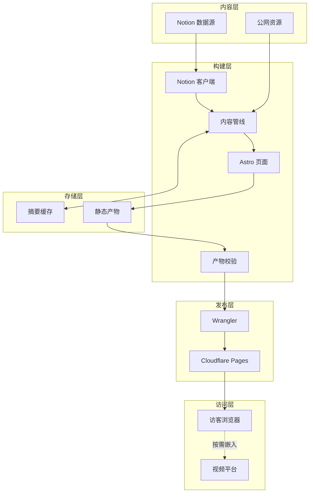
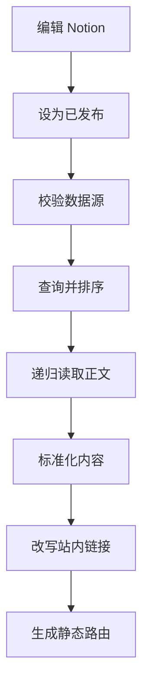
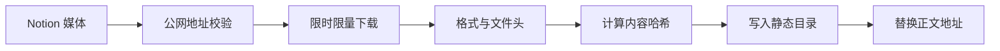
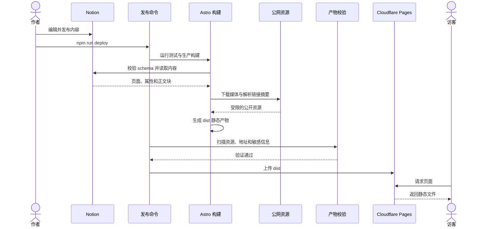

---
tags:
  - project
  - typescript
  - personal-website
  - astro
created: 2026-07-19
---

# WENREN / wenren-home

> [!info] 一句话定位
> 以 Notion 为内容后台、由 Astro 静态生成并部署到 Cloudflare Pages 的个人网站，用于展示职业经历、独立作品与日常记录。

**仓库路径：** `~/code/website`
**版本：** `1.0.0`
**语言：** TypeScript 6.0 / Astro 7.1
**运行要求：** Node.js 22.13+
**本地端口：** `http://localhost:4321`
**线上地址：** [https://wenren.cc](https://wenren.cc)

---

## 整体架构



> [!note] 设计理念
> Notion 只在构建阶段充当内容源。部署完成后，线上没有常驻 Node.js 服务，也不会在访客请求中访问 Notion；Cloudflare Pages 只负责分发已经生成好的 HTML、CSS、JavaScript 和媒体文件。

### 外部服务

| 服务 | 参与阶段 | 用途 | 失败影响 |
|------|----------|------|----------|
| Notion API | 构建 | 读取“网站内容”数据源、页面属性和正文块 | 生产构建终止 |
| 外部网页与媒体源 | 构建 | 下载图片、读取外链标题与摘要 | 图片失败会终止构建；链接摘要失败只降级为普通链接 |
| Cloudflare Pages | 发布与访问 | 托管 `dist/`，提供 CDN、缓存响应头和自定义域名 | 无法发布或访问站点 |
| YouTube / Vimeo / Loom | 访问 | 对正文里的受信视频地址提供嵌入播放器 | 只影响对应视频，正文仍可访问 |

## 目录结构

```text
.
├── src/
│   ├── pages/                 # 首页、分类页、文章静态路由和 404 页面
│   ├── components/            # 页面组件、Notion 块与媒体渲染器
│   ├── content/               # 内容编排、链接改写、外链摘要和测试快照
│   ├── lib/notion/            # Notion 客户端、schema、块解析和媒体本地化
│   ├── lib/network/           # 只允许访问公网的安全请求层
│   ├── layouts/               # 全站 HTML、SEO 和社交分享元数据
│   └── styles/                # 全局、列表、文章和 Notion 正文样式
├── public/                    # 字体、图标和 Cloudflare `_headers`
├── scripts/                   # 资源清理、测试夹具和部署前产物校验
├── tests/                     # Node.js 测试与静态产物验收
├── astro.config.mjs           # 静态输出、站点域名和 Vite 构建配置
├── wrangler.jsonc             # Cloudflare Pages 项目配置
├── deploy.command             # macOS 一键检查、登录、构建与发布
├── .env.example               # 可提交的环境变量模板
└── package.json               # 依赖、构建、测试与部署命令
```

## 技术栈速查

| 层级 | 技术 | 版本 | 用途 |
|------|------|------|------|
| 运行环境 | Node.js | `>=22.13.0` | 构建、测试和部署 |
| 页面框架 | Astro | `7.1.1` | 生成纯静态页面和客户端小脚本 |
| 开发语言 | TypeScript | `6.0.3` | 内容模型、Notion 管线和页面逻辑 |
| 内容接口 | Notion API | `2026-03-11` | 数据源查询、分页和正文块读取 |
| 网络请求 | Undici | `7.28.0` | 固定 DNS 结果并安全抓取公网资源 |
| 链接摘要 | linkpeek | `2.1.1` | 提取外部网页标题、站点名和摘要 |
| 图片分析 | image-size | `2.0.2` | 读取图片尺寸与方向 |
| 部署工具 | Wrangler | `4.112.0` | 本地模拟并上传 Cloudflare Pages |
| 类型检查 | Astro Check | `0.9.9` | 检查 Astro 与 TypeScript |
| 托管平台 | Cloudflare Pages | 托管服务 | 分发静态站点与缓存资源 |

## 核心特点

| 特点 | 说明 |
|------|------|
| Notion 内容后台 | 作者只需在固定数据源中编辑内容并切换为“已发布” |
| 完全静态部署 | 每条内容都生成站内详情页，访问时不依赖 Notion 或数据库 |
| 严格内容契约 | 构建前验证字段类型、固定选项、必填值、Slug 和正文完整性 |
| 完整正文呈现 | 支持标题、列表、待办、折叠、引用、代码、表格、分栏、图片和视频等常用块 |
| 媒体本地化 | 临时图片和 Notion 上传视频按内容哈希保存，避免链接过期 |
| 外链摘要 | 构建时为正文外链生成标题与摘要，并使用磁盘缓存降低重复请求 |
| 安全发布 | 防止私网抓取、危险协议、伪造媒体、密钥和 Notion 临时地址进入产物 |
| 克制的客户端脚本 | 仅保留十进制年份、媒体回退和链接摘要定位等必要交互 |

## Notion 内容系统

### 发布与排序

| 能力 | 规则 |
|------|------|
| 发布过滤 | 只查询 `状态 = 已发布` 的页面，草稿、归档和回收站内容不会生成路由 |
| 稳定排序 | `置顶` 降序 → `排序` 升序 → `发布日期` 降序 → `最后编辑时间` 降序 |
| 分类映射 | `职业经历` → `career`、`个人作品` → `works`、`流水账` → `journal` |
| 路由生成 | 每条内容生成 `/<category>/<slug>/`，全站 Slug 必须唯一 |
| 内链迁移 | 指向同一数据源页面的 Notion 链接会改写为站内静态地址 |
| 构建缓存 | 同一次 Astro 构建只读取一次完整内容，所有页面共享查询结果 |



### 正文块

| 类型 | 支持内容 |
|------|----------|
| 文本 | 段落、三级标题、引用、公式、分隔线和富文本格式 |
| 列表 | 无序列表、有序列表、待办项和折叠块 |
| 结构 | Callout、代码块、表格、分栏和同步块 |
| 媒体 | 图片、原生视频和受信视频嵌入 |
| 链接 | 行内链接、独立链接卡片、书签和 Notion 页面内链 |

## 媒体与外链处理

### 媒体本地化

| 能力 | 说明 |
|------|------|
| 下载范围 | Notion 托管图片、Notion 上传视频，以及正文中的外部图片 |
| 文件命名 | 使用文件内容的 SHA-256 哈希，天然去重并适合长期缓存 |
| 输出位置 | 开发模式写入 `public/notion-assets/`，生产构建写入 `dist/notion-assets/` |
| 图片格式 | AVIF、GIF、JPEG、PNG、WebP；保留 GIF 动画 |
| 视频格式 | MP4、WebM；其他视频地址降级为外链 |
| 大小限制 | 项目将图片限制为 10 MiB、视频限制为 25 MiB，并按 25 MiB 校验所有 Pages 文件 |
| 完整性检查 | 同时检查响应类型、扩展名、文件头、内容哈希和页面引用 |



### 外链摘要

| 能力 | 说明 |
|------|------|
| 抓取范围 | 正文、表格、书签和链接预览块中的站外 HTTP(S) 地址 |
| 并发控制 | 默认 4 路并发，硬上限 8 路 |
| 缓存目录 | `.cache/link-previews/v1/`，缓存文件名不泄漏原始 URL |
| 缓存时效 | 成功结果 7 天，失败结果 1 小时；抓取失败时可使用 30 天内的旧成功结果 |
| 安全边界 | 禁止凭据、非默认端口、私网或本机地址，并逐跳检查重定向 |
| 降级方式 | 摘要失败只输出普通安全链接，不阻断整站构建 |

## 静态页面与展示

| 模块 | 说明 |
|------|------|
| 首页 | 展示身份信息、年度实时进度、三个内容分类和联系方式 |
| 分类页 | 分别列出职业经历、个人作品和流水账，并展示摘要与发布日期 |
| 文章页 | 渲染完整 Notion 正文、封面、发布时间、更新时间和返回导航 |
| SEO | 为每个页面生成描述、Canonical URL 和 Open Graph 元数据 |
| 无障碍 | 使用语义化结构、键盘焦点、读屏文案和减少动态效果偏好 |
| 安全响应头 | 通过 `public/_headers` 配置 CSP、禁止 iframe 套壳和长期静态缓存 |

## 核心数据模型

### Notion 数据源字段

| 字段 | Notion 类型 | 必填 | 约束与用途 |
|------|-------------|------|------------|
| `标题` | Title | 是 | 1～100 个字符 |
| `Slug` | Rich text | 是 | 小写字母、数字和连字符；最多 80 个字符；全站唯一 |
| `分类` | Select | 是 | `职业经历`、`个人作品`、`流水账` 三选一 |
| `状态` | Select | 是 | `草稿`、`已发布`、`归档`；只有已发布内容进入网站 |
| `摘要` | Rich text | 是 | 1～200 个字符，用于列表和页面描述 |
| `发布日期` | Date | 是 | 页面展示与排序依据 |
| `排序` | Number | 否 | 0～9999 的整数；空值按 1000 处理 |
| `置顶` | Checkbox | 否 | 置顶内容优先展示 |
| `外部链接` | URL | 否 | 仅接受 HTTP(S)，作为内容元数据保留 |
| `标签` | Multi-select | 否 | 文章标签元数据 |
| `封面` | Files | 否 | 优先于 Notion 页面封面，并在构建时本地化 |

### `ContentEntry`

| 字段 | 类型 | 说明 |
|------|------|------|
| `id` | `string` | Notion 页面 ID |
| `title` / `summary` | `string` | 页面标题与摘要 |
| `slug` | `string` | 已校验的全站唯一 Slug |
| `category` | `career \| works \| journal` | 稳定的站内分类 |
| `publishedAt` / `updatedAt` | `string` | 发布与最后编辑时间 |
| `order` / `featured` | `number` / `boolean` | 人工排序与置顶标记 |
| `tags` | `string[]` | 标签列表 |
| `route` | `string` | 生成后的站内静态路由 |
| `cover` | `ContentImage \| null` | 已标准化的封面信息 |
| `blocks` | `ContentBlock[]` | 递归正文块树 |

### `ContentBlock`

| 字段 | 类型 | 说明 |
|------|------|------|
| `id` | `string` | Notion 块 ID |
| `type` | `ContentBlockType` | 规范化后的块类型 |
| `richText` | `ContentRichText[]` | 文本、链接、格式和外链摘要 |
| `children` | `ContentBlock[]` | 递归子块，最大深度 24 层 |
| `image` / `video` | 媒体对象 | 本地化状态、来源、尺寸和安全地址 |
| `caption` / `cells` | 富文本数组 | 媒体说明和表格单元格 |
| 其余可选字段 | 字符串或布尔值 | 代码语言、待办状态、公式、Callout 图标等 |

## 核心调用链



## 接入方式

### 网站路由

| 方法 | 路径 | 说明 |
|------|------|------|
| `GET` | `/` | 个人主页和三个内容分类入口 |
| `GET` | `/career/` | 职业经历列表 |
| `GET` | `/works/` | 个人作品列表 |
| `GET` | `/journal/` | 流水账列表 |
| `GET` | `/<category>/<slug>/` | Notion 内容生成的静态详情页 |
| `GET` | `/404.html` | 静态 404 页面 |

> [!note] 接口边界
> 项目不提供 REST API、GraphQL 或后台管理接口；内容写入只发生在 Notion，网站本身只暴露静态页面。

### 使用离线夹具运行

不需要 Notion 密钥，适合首次启动、样式开发和自动化测试：

```bash
npm ci
npm run dev:fixture
```

浏览器访问 `http://localhost:4321`。该模式会生成固定媒体夹具并使用 `src/content/test-content.ts`，不会访问真实 Notion 账户。

### 使用真实 Notion 内容运行

```bash
npm ci
cp .env.example .env
chmod 600 .env
```

编辑 `.env`，填入具有数据源读取权限的 `NOTION_TOKEN`；确认 Notion 内部连接已经被添加到“网站内容”数据源。然后启动开发服务器：

```bash
npm run dev
```

开发服务器启动时会重新读取 Notion，并清理上一次生成的 `public/notion-assets/`，避免已经撤回的媒体残留。

### 本地检查生产产物

以下命令需要已经配置真实 Notion 凭据：

```bash
npm run build
npm run verify:dist
npm run preview
```

如果需要同时模拟 Cloudflare Pages 的本地行为，运行 `npm run pages:dev`；实际监听地址以 Wrangler 输出为准。

## CLI 命令速查

| 命令 | 功能 | 说明 |
|------|------|------|
| `npm run clean:notion-assets` | 清理开发媒体 | 删除经过路径校验的 `public/notion-assets/` |
| `npm run prepare:fixture-media` | 生成测试媒体 | 写入内容哈希固定的 PNG、GIF 和 MP4 夹具 |
| `npm run dev` | 真实内容开发 | 从 Notion 读取内容并启动 Astro |
| `npm run dev:fixture` | 离线开发 | 使用固定内容与媒体夹具启动 Astro |
| `npm run check` | 类型检查 | 执行 `astro check` |
| `npm run build` | 生产构建 | 强制使用 Notion，并生成 `dist/` |
| `npm run build:fixture` | 测试构建 | 不访问 Notion，生成可重复的 `dist/` |
| `npm run preview` | 预览产物 | 使用 Astro 预览已有生产目录 |
| `npm run pages:dev` | Pages 本地模拟 | 生产构建后由 Wrangler 托管 `dist/` |
| `npm run verify:dist` | 校验产物 | 检查文件大小、哈希、引用、凭据和临时地址 |
| `npm test` | 完整测试 | 类型检查、夹具构建、Node.js 测试和产物校验 |
| `npm run deploy` | 正式发布 | 测试、生产构建、再次校验并上传 Cloudflare Pages |
| `predev` / `prebuild` | npm 生命周期钩子 | 自动清理开发媒体，不需要手动执行 |
| `predev:fixture` / `prebuild:fixture` | 夹具生命周期钩子 | 自动清理并重建测试媒体，不需要手动执行 |

## 配置参考

| 环境变量 | 默认值 | 说明 |
|----------|--------|------|
| `NOTION_TOKEN` | 无 | 真实内容开发、生产构建和部署必填；只需要读取权限 |
| `NOTION_DATA_SOURCE_ID` | `edd7fd6c-d863-4b1a-96c2-8ae3804d5433` | “网站内容”数据源 ID；代码有该回退值，`deploy.command` 仍要求 `.env` 明确填写 |
| `CONTENT_SOURCE` | `notion` | 内容来源；项目脚本会在离线模式中自动设为 `fixture` |
| `CLOUDFLARE_API_TOKEN` | 无 | 无浏览器或 CI 发布时可选，用于替代 Wrangler OAuth |
| `CLOUDFLARE_ACCOUNT_ID` | 无 | 使用 Cloudflare API Token 时配套填写 |
| `NODE_ENV` | 由 Astro 管理 | 开发时媒体写入 `public/`，生产构建时写入 `dist/` |

> [!tip] 密钥管理
> 从 `.env.example` 创建本地 `.env`，并保持文件权限为 `600`。`.env` 已被 Git 忽略；部署前校验还会扫描 `dist/`，一旦发现 Notion 密钥、签名 URL 或临时资源域名就会终止发布。

## 部署方式

当前部署方式是“本机完成生产构建，再由 Wrangler 直接上传 `dist/`”。Cloudflare Pages 项目名固定为 `wenren-home`，生产分支固定为 `main`，站点规范域名固定为 `https://wenren.cc`。

### 部署前提

| 项目 | 要求 |
|------|------|
| Node.js | `22.13.0` 或更高版本；仓库提供 `.nvmrc` |
| Notion | `.env` 中包含有效只读密钥，内部连接已共享到目标数据源 |
| Cloudflare | 当前账户能够发布 Pages 项目 `wenren-home` |
| 依赖 | 使用 `npm ci` 按 `package-lock.json` 安装，包括开发依赖 |

### macOS 一键部署

在 Finder 中双击 `deploy.command`，或在终端执行：

```bash
./deploy.command
```

脚本会依次完成以下工作：

1. 检查 Node.js、npm、`.env` 和必需变量。
2. 将 `.env` 权限收紧为 `600`。
3. 根据锁文件、系统架构和 Node ABI 判断是否需要重新执行 `npm ci`。
4. 检查 Wrangler 登录状态，首次运行时通过浏览器 OAuth 登录并写入 macOS 钥匙串。
5. 执行 `npm run deploy`，任何测试、构建或校验失败都会阻止上传。

### 命令行部署

首次使用当前机器时：

```bash
npm ci
npx wrangler login --use-keyring
```

之后每次发布只需：

```bash
npm run deploy
```

`npm run deploy` 的固定流水线如下：

```text
npm test
  → CONTENT_SOURCE=notion astro build
  → npm run verify:dist
  → wrangler pages deploy dist --project-name wenren-home --branch main --env-file .env
```

在无浏览器环境中，可在 `.env` 中同时配置 `CLOUDFLARE_API_TOKEN` 与 `CLOUDFLARE_ACCOUNT_ID`，然后执行相同的 `npm run deploy`。不要把 `.env` 提交到仓库。

### 常见发布失败

| 现象 | 根因 | 处理方式 |
|------|------|----------|
| 提示缺少 `NOTION_TOKEN` | `.env` 不存在、为空或未被读取 | 从 `.env.example` 重建并检查文件权限 |
| 提示字段缺失或类型不匹配 | Notion 数据源 schema 被改名或改型 | 按“Notion 数据源字段”表恢复字段与固定选项 |
| 提示正文为空或存在不支持块 | 已发布页面不满足静态渲染约束 | 补充正文，或把不支持的块转换为受支持类型 |
| 提示媒体超限或格式不匹配 | 文件过大、响应类型错误或文件损坏 | 压缩文件，并转换为支持的图片、MP4 或 WebM |
| Wrangler 无法识别账户 | OAuth 失效或 API Token 配置错误 | 运行 `npx wrangler whoami --env-file .env --json` 检查身份 |
| 外链摘要出现警告 | 目标网页拒绝抓取、超时或 DNS 不安全 | 构建会保留普通链接；无需阻塞发布 |

## 关键边界 & 约束

- Notion 内容不会实时同步。每次编辑后都必须重新构建和部署，线上页面才会更新。
- 生产构建必须访问 Notion API；测试和离线开发应使用 `fixture` 模式。
- Slug 只能包含小写字母、数字和单个连字符分隔段，最长 80 个字符，并且必须全站唯一。
- 正文最大递归深度为 24 层。未知块以及音频、文件、PDF、子页面、子数据库、目录和面包屑块会阻止发布，避免静默丢失内容。
- 项目将图片限制为 10 MiB，并按 25 MiB 限制 Notion 上传视频与所有 Cloudflare Pages 文件。
- 远程图片会在构建时下载到本站；生产 HTML 不允许继续引用远程 `` 或 Notion 临时资源地址。
- 只有 YouTube、Vimeo 和 Loom 会进入 iframe；其他嵌入地址会降级为普通链接。
- 公网抓取会拒绝私网、本机、含凭据、非默认端口和异常重定向地址，避免构建机被用来访问内部服务。
- 自定义域名、DNS 和 Cloudflare Pages 项目本身由 Cloudflare 账户管理，不在仓库配置中创建。
