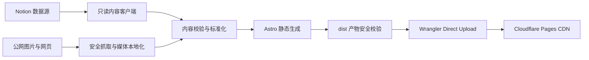

# Wenren Home

一个可以直接 Fork 或克隆使用的 Notion 个人网站：Astro 在构建阶段读取 Notion 内容，生成完整静态页面，再通过 Cloudflare Pages Direct Upload 发布。

线上示例：[wenren.cc](https://wenren.cc)

这个仓库同时是 Wenren 当前网站的生产代码和可复用模板。使用者不需要修改内容管线或部署脚本，只需完成两类本机配置：

1. 从 [`site.config.example.mjs`](./site.config.example.mjs) 创建被 Git 忽略的 `site.config.mjs`，填写公开站点信息；
2. 从 [`.env.example`](./.env.example) 创建 `.env`，填入自己的 Notion 与 Cloudflare 配置。

仓库只提交虚构的 Alice 示例配置和内容。个人域名、邮箱、社交账号、Notion 页面映射、Token 与 Data Source ID 都不会进入 Git。

## 快速预览

Node.js 需要 22.13 或更高版本，仓库已经提供 `.nvmrc`。

```bash
git clone https://github.com/shaun17/wenren-home.git
cd wenren-home
nvm use
npm ci
npm run dev:fixture
```

打开终端显示的本地地址。`dev:fixture` 使用仓库内的固定示例内容和媒体，不读取 `.env`，也不会访问 Notion。

## 项目能力

- 三栏首页、分类列表和 `/<category>/<slug>/` 静态文章页；
- Notion 数据源 schema、必填内容、Slug、分类和发布状态校验；
- 段落、标题、列表、待办、折叠、引用、代码、表格、分栏、图片、视频、书签等常用 Notion 块；
- Notion 页面内链自动改写为站内路由，可配置迁移前的旧页面 ID；
- Notion 临时图片和上传视频本地化，并使用内容哈希命名；
- 构建时解析外链标题与摘要，带并发限制、磁盘缓存和失败降级；
- 私网访问、危险协议、超大媒体、失效临时地址和凭据泄漏防护；
- 完全静态输出，访客访问时不依赖 Notion、Node.js 或数据库。

## 架构



Notion 只参与构建。线上没有常驻服务端，也不会把 Notion Token 发送给 Cloudflare 或浏览器。

### 使用的服务

| 服务 | 阶段 | 用途 | 是否必需 |
| --- | --- | --- | --- |
| Notion API `2026-03-11` | 生产构建 | 读取数据源、页面属性和正文块 | 使用真实内容时必需 |
| 外部网页与媒体源 | 生产构建 | 下载图片、读取外链摘要 | 按文章内容决定 |
| Cloudflare Pages | 部署与访问 | 托管和分发 `dist/` | 默认部署方式必需 |
| YouTube / Vimeo / Loom | 访客访问 | 播放受信任的视频嵌入 | 仅对应正文使用时需要 |

### 代码边界

```text
.
├── site.config.example.mjs     # 可安全提交的虚构示例配置
├── site.config.mjs             # 被 Git 忽略的本机个人配置
├── src/
│   ├── config/                 # 配置校验和站点域名判断
│   ├── content/                # 内容编排、内链、外链摘要和 fixture
│   ├── lib/notion/             # Notion API、schema、块解析、媒体本地化
│   ├── lib/network/            # 只允许访问公网的安全请求层
│   ├── components/             # 页面与 Notion 块组件
│   ├── layouts/                # HTML、SEO 和分享元数据
│   ├── pages/                  # 首页、分类、文章和 404 静态路由
│   └── styles/                 # 全站样式
├── scripts/
│   ├── deploy/                 # 部署环境隔离和子进程执行
│   ├── deploy.mjs              # 测试、构建、校验、上传编排
│   └── verify-static-output.mjs # 最终静态产物安全校验
├── public/                     # 图标、字体、字体许可和 Pages 响应头
└── tests/                      # 单元、内容、安全和最终 HTML 验收测试
```

## 1. 创建本机站点配置

先复制可提交的虚构示例，再编辑本机文件：

```bash
cp site.config.example.mjs site.config.mjs
```

`site.config.mjs` 已在 `.gitignore` 中，普通 `git add` 不会收录；不要使用 `git add -f` 强制提交它。`site.config.example.mjs` 始终保持 Alice、`example.com` 和空页面映射。

| 配置 | 用途 |
| --- | --- |
| `locale` | HTML 页面语言 |
| `origin` | 正式 HTTPS 地址，用于 Canonical、Open Graph 和站内链接判断；没有自定义域名时填写 `https://<项目名>.pages.dev` |
| `brand` | 品牌名、浏览器标题、分享标题、页首身份和默认描述 |
| `home` | 首页标题、分类链接和个人简介 |
| `contacts` | 联系方式；`external` 决定是否打开新标签页 |
| `categories` | 三列名称、说明和对应的 Notion Select 选项 |
| `designCredit` | 页脚设计灵感致谢 |
| `features.linkPreviews` | 是否在生产构建时抓取正文外链摘要 |
| `content.legacyPageAliases` | 可选的“旧 Notion 页面 ID → 当前页面 ID”映射 |

`career`、`works`、`journal` 是固定路由键，不要修改。显示名称和对应的 `notionOption` 可以修改，但 Notion 数据源中的 Select 选项必须同步。

如果没有迁移过 Notion 页面，把旧页面别名留空即可：

```js
content: {
  legacyPageAliases: {},
},
```

配置会在 Astro 启动前校验。无效域名、危险联系方式、重复分类或错误页面 ID 会直接终止构建。

## 2. 准备 Notion 内容源

### 创建数据源

在 Notion 中创建一个全页数据库，并按下表配置字段。字段名称和类型必须一致。

| 字段 | Notion 类型 | 必填 | 规则或选项 |
| --- | --- | --- | --- |
| `标题` | Title | 是 | 1–100 个字符 |
| `Slug` | Text | 是 | 小写字母、数字和中划线，最长 80 个字符，全站唯一 |
| `分类` | Select | 是 | 与本机 `site.config.mjs` 的三个 `notionOption` 一致 |
| `状态` | Select | 是 | `草稿`、`已发布`、`归档` |
| `摘要` | Text | 是 | 1–200 个字符 |
| `发布日期` | Date | 是 | 用于展示和排序 |
| `排序` | Number | 否 | 0–9999，数字越小越靠前 |
| `置顶` | Checkbox | 否 | 置顶内容优先 |
| `外部链接` | URL | 否 | 仅允许 HTTP(S)，作为内容元数据保留 |
| `标签` | Multi-select | 否 | 可自由添加 |
| `封面` | Files & media | 否 | 构建时下载为本地静态资源 |

每个数据库页面的正文就是文章正文。只有 `状态 = 已发布` 的页面会生成网站路由，排序顺序为：置顶 → 人工排序 → 发布日期 → 最后编辑时间。

### 创建只读 Integration

1. 在 Notion 创建 Internal Integration，只授予读取内容所需权限；
2. 打开原始数据库，通过右上角菜单的 `Add connections` 把它共享给 Integration；
3. 在 `Manage data sources` 中复制 Data Source ID，或调用 Retrieve a database API 后读取 `data_sources[].id`；
4. 复制环境变量模板并填写真实值。

Notion 的 `database_id` 与 `data_source_id` 不是同一个值，本项目需要后者。可参考 [Notion：Working with databases](https://developers.notion.com/guides/data-apis/working-with-databases) 和 [Query a data source](https://developers.notion.com/reference/query-a-data-source)。

```bash
cp site.config.example.mjs site.config.mjs
cp .env.example .env
chmod 600 .env
```

```dotenv
NOTION_TOKEN=ntn_xxx
NOTION_DATA_SOURCE_ID=xxxxxxxx-xxxx-xxxx-xxxx-xxxxxxxxxxxx
ALLOW_EMPTY_SITE=false

CLOUDFLARE_PAGES_PROJECT=my-portfolio
CLOUDFLARE_API_TOKEN=
CLOUDFLARE_ACCOUNT_ID=
```

`.env` 已被 Git 忽略。正式构建查询不到任何已发布内容时会失败，避免权限或过滤错误把线上站点覆盖为空；只有确实需要空站时才设置 `ALLOW_EMPTY_SITE=true`。

`npm run dev`、`npm run build` 和 `npm run deploy` 还会检查本机 `site.config.mjs` 是否存在。fixture、类型检查和 CI 在没有本机配置时自动使用 Alice 示例，因此 Fork 后无需任何个人文件即可验证工程。

## 3. 本地运行

使用真实 Notion 内容：

```bash
npm run dev
```

不使用任何密钥的 fixture 模式：

```bash
npm run dev:fixture
```

生成并预览真实生产产物：

```bash
npm run build
npm run verify:dist
npm run preview
```

### 命令速查

| 命令 | 用途 |
| --- | --- |
| `npm run dev` | 从 Notion 读取真实内容并启动 Astro |
| `npm run dev:fixture` | 使用固定示例内容离线开发 |
| `npm run build` | 从 Notion 生成生产 `dist/` |
| `npm run build:fixture` | 生成可重复的测试站点 |
| `npm run check` | Astro 与 TypeScript 类型检查 |
| `npm run validate:site-config` | 验证本机个人配置存在且结构有效 |
| `npm test` | 类型检查、fixture 构建、完整测试和产物校验 |
| `npm run verify:dist` | 检查文件大小、哈希、引用、临时地址和凭据 |
| `npm run pages:dev` | 构建真实内容并用 Wrangler 本地运行 Pages |
| `npm run cloudflare:login` | 使用浏览器登录 Cloudflare |
| `npm run pages:create` | 按 `.env` 创建 Direct Upload 项目，只需执行一次 |
| `npm run deploy` | 测试、真实构建、安全校验并上传生产站点 |

## 4. 部署到 Cloudflare Pages

本项目使用 [Cloudflare Pages Direct Upload](https://developers.cloudflare.com/pages/get-started/direct-upload/)，由本机或 CI 生成 `dist/` 后上传，不要求 Cloudflare 访问 Git 仓库。

### 首次部署

先在 `.env` 填写一个当前账户中尚未使用的项目名：

```dotenv
CLOUDFLARE_PAGES_PROJECT=my-portfolio
```

桌面环境可以使用 OAuth：

```bash
npm run cloudflare:login
npm run pages:create
npm run deploy
```

CI 或无浏览器环境需要先在工作目录生成不入库的 `site.config.mjs`，再通过 CI Secret 提供 `NOTION_TOKEN`、`NOTION_DATA_SOURCE_ID`、`CLOUDFLARE_API_TOKEN` 与 `CLOUDFLARE_ACCOUNT_ID`，最后运行相同的 `pages:create` 和 `deploy` 命令。仓库自带的 GitHub Actions 只验证 Alice fixture，不执行生产部署。

`pages:create` 使用 `main` 作为生产分支。已经在 Cloudflare 创建过项目时不要重复执行，确认 `.env` 的项目名一致后直接运行 `npm run deploy`。

macOS 也可以双击 [`deploy.command`](./deploy.command)。它会检查 Node.js、`.env` 和依赖，必要时引导 OAuth 登录，然后调用同一套部署流程。

### 部署流水线

```text
npm test（无凭据 fixture）
  → npm run build（只注入 Notion 凭据）
  → npm run verify:dist（使用临时密钥清单扫描真实产物）
  → wrangler pages deploy（只注入 Cloudflare 凭据）
```

部署脚本不会把 `NOTION_TOKEN`、`NOTION_DATA_SOURCE_ID` 或其他未知环境变量传给 Wrangler。Notion 与 Cloudflare 凭据的原值、URL/Base64/Base64URL、十六进制、Unicode 转义等常见表示都会参与最终产物扫描。

Direct Upload 项目创建后不能直接切换为 Cloudflare Git integration；如果将来要由 Cloudflare 监听 Git 推送，需要另建 Git integration 项目。

### 自定义域名

部署成功后，在 Cloudflare Pages 项目中添加本机 `site.config.mjs` 的 `origin` 域名，并按 Cloudflare 提示配置 DNS。仓库不会自动修改账户中的域名或 DNS。

## 内容与安全边界

- Notion 内容不是实时同步；每次发布或修改后都需要重新构建部署；
- 图片限制为 10 MiB，Notion 上传视频及任意 Pages 单文件限制为 25 MiB；
- Notion 临时媒体会下载到 `notion-assets/`，文件名由 SHA-256 内容哈希生成；
- 外部抓取拒绝 localhost、私网、链路本地、云元数据、含凭据地址、异常端口和不安全重定向；
- 外链摘要抓取失败只降级当前链接，不中断构建；媒体下载或内容契约失败会阻止发布；
- 受信视频只支持 YouTube、Vimeo 和 Loom，其他嵌入地址降级为普通链接；
- GitHub Actions 的 fixture CI 不需要任何仓库 Secret，也不会访问个人 Notion。
- Git 只跟踪 `site.config.example.mjs` 和 `.env.example`；个人 `site.config.mjs` 与 `.env` 均被忽略。

## 许可证

项目代码使用 [MIT License](./LICENSE)。

仓库内 Geist 与 Geist Mono 字体由 Geist Project Authors 提供，使用 SIL Open Font License 1.1。完整许可见 [`public/fonts/OFL.txt`](./public/fonts/OFL.txt)，第三方说明见 [`THIRD_PARTY_NOTICES`](./THIRD_PARTY_NOTICES)。

设计致谢默认保留在站点页脚：Design inspired by [Ryo Lu](https://ryo.lu/) ↗。
